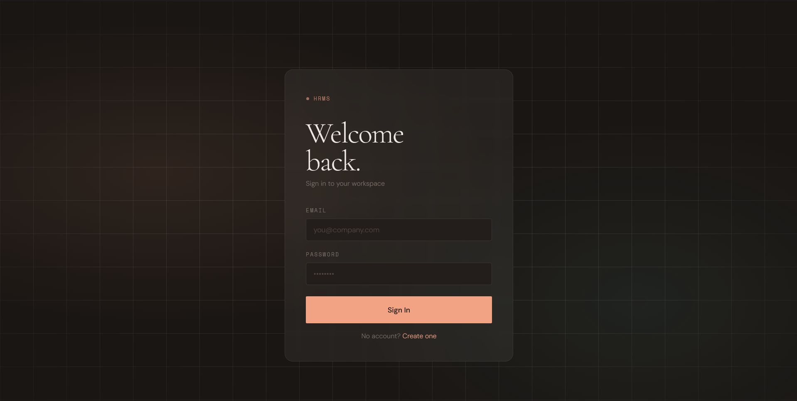
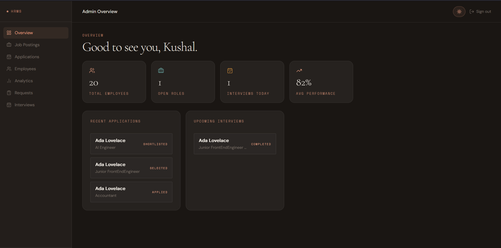
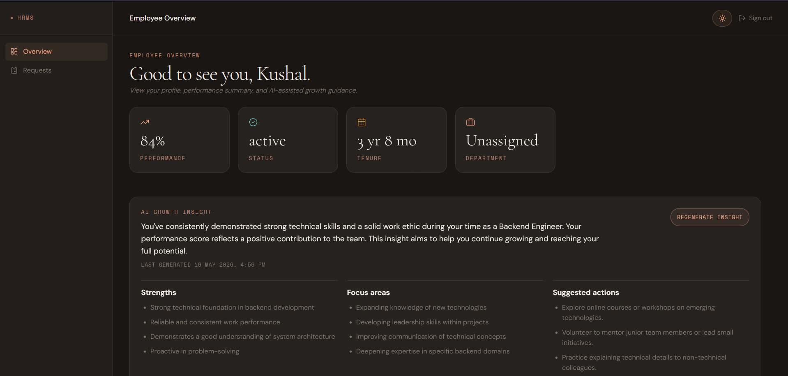

# AI-Native HRMS Portal

This is an HRMS portal. One place to run hiring, keep employee information, handle HR requests, and review basic workforce trends. Admin, HR, Employee, and Candidate each get their own login and dashboard.

This build is AI native. AI helps during everyday HR work: reviewing applications, summarizing interviews, drafting employee requests, and highlighting patterns in workforce data. Users work in the standard hiring and HR screens. Suggestions appear inside those screens.

**Live demo:** not deployed yet.

## Capabilities

- Post jobs and manage applications
- Screen resumes with a match score, summary, strengths, concerns, and a shortlist / hold / reject style recommendation
- Schedule interviews, add meeting links, and get written feedback from interview transcripts
- Browse employees and view growth related notes
- Open an HR analytics view for workforce summaries
- Employees can submit HR requests. Optional help turning rough notes into a clear request
- Work as Admin, HR, Employee, or Candidate with role based access

Payroll, benefits, tax, HR chatbot, and automated candidate tests are not in this version.

## Is it fully automated?

No. AI produces suggestions. HR and admins still choose who to interview, who to hire, and which requests to approve. The system does not change hiring or employment status on its own.

## Screenshots

Login



Admin



Employee



---

## For developers

Repo: https://github.com/Kushal2205a/ai-native-hrms-portal

### Stack

Next.js 16, React 19, Server Actions, Supabase (Auth + Postgres), Tailwind, shadcn/ui, NVIDIA API (`google/gemma-3n-e4b-it`).

### Setup

Requirements: Node 20+, Supabase project, [NVIDIA API key](https://build.nvidia.com).

```bash
git clone https://github.com/Kushal2205a/ai-native-hrms-portal.git
cd ai-native-hrms-portal
npm install
cp .env.example .env.local
npm run dev
```

Database: create a Supabase project, run `supabase/migrations/0001_baseline_schema.sql` in the SQL editor, enable Auth and RLS, create users and set `profiles.role` to `admin`, `hr`, `employee`, or `candidate`.

| Variable | Description |
|----------|-------------|
| `NEXT_PUBLIC_SUPABASE_URL` | Supabase project URL |
| `NEXT_PUBLIC_SUPABASE_ANON_KEY` | Supabase anon key |
| `NVIDIA_API_KEY` | NVIDIA API key |

App URL after start: http://localhost:3000

AI calls run server side only. Validate JSON before writing to the database. Enforce roles on the server, not only in the UI.

### License

MIT. See [LICENSE](LICENSE).
